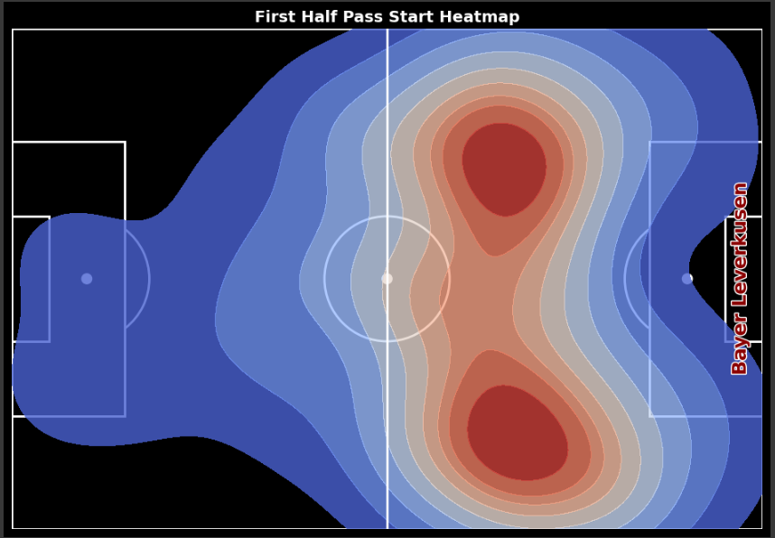
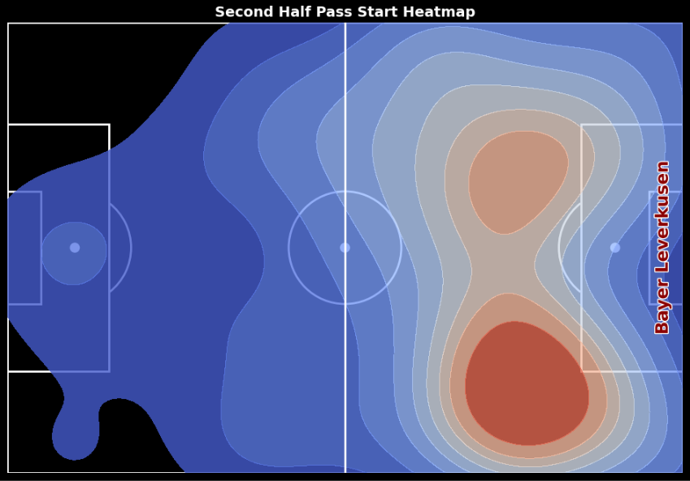

📊 Football Pass Heatmap Comparison (First Half vs Second Half)
This project uses the StatsBomb open data and Python's data science stack to fetch football event data, process pass locations, and visualize first-half and second-half pass origin heatmaps. The result is an insightful side-by-side comparison of team passing patterns across both halves of a match.

⚽ Features
✅ Fetches match data via the StatsBomb API (Open Data)

✅ Cleans and structures pass event data

✅ Extracts pass start and end coordinates

✅ Splits the data into first half and second half

✅ Visualizes pass origin density using KDE heatmaps

✅ Includes a reusable function to plot heatmaps on a full pitch

✅ Supports team-specific annotations and stylized visual design

🛠️ Tech Stack
Python

pandas

matplotlib

seaborn

pathlib, json

matplotlib.patheffects (for text styling)

📁 Data Source
All data used in this project comes from StatsBomb's public open data, available here:

🔗 https://github.com/statsbomb/open-data

### 🧑‍💻 Author

Developed by **Agnideep Mukherjee**

Feel free to reach out for feedback, collaboration, or ideas!

---
## 🔥 Sample Match: Bayer Leverkusen vs Hoffenheim — Bundesliga (2024-05-08)
Score: 2 - 1 | Venue: Bay Arena | Date: May 8, 2024

### 📸 First Half Pass Heatmap

### 📸 Second Half Pass Heatmap

---
